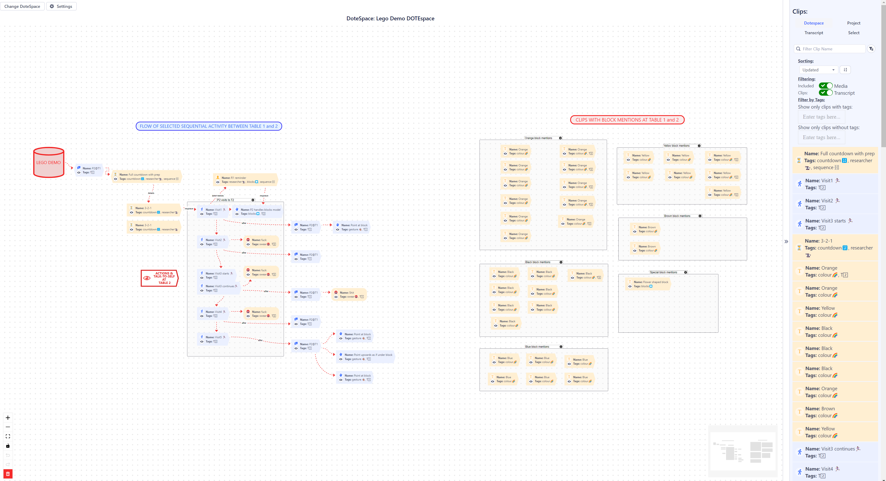

## How to use the Canvas

A 2D visual canvas is available for arranging and grouping your clips and their relationships.
This is good for mind-mapping as a perspective or an analysis is developing while you are making clips from your DOTEspace.

At present, only one Canvas can be opened for each DOTEspace.
Each Canvas is stored and will be reopened when selected the next time you restart _DOTEbase_.

The Canvas space is infinite in all directions.
One can add clusters of Clips in multiple locations on the Canvas, though with 100s of clips it may become cluttered.

Note that unlike for the main DOTEbase tools, actions on the Canvas (moving clips, connecting lines etc) can be undone and redone (see the buttons on the bottom left of the Canvas panel).

### Open and select a Canvas

- Click on the `Open Canvas` button.
- Click on the `Change DOTEspace` button.
- Select a DOTEspace and its canvas.
- A fresh canvas will open or the prior populated canvas will reopen.
- A clips panel opens on the right

When selecting a clip etc on the Canvas a node settings panel opens.
To revert to the clips panel, just click somewhere else in blank space until the panel reopens.

### Resizing and moving the canvas

One can resize the canvas, re-center the Canvas and lock the canvas using the buttons in the bottom left of the Canvas panel.
Use the +/- buttons to zoom in and out.
Use the square button to fit everything in and re-centre

One can also clean the Canvas completely to start from square one again.
The old Canvas cannot be recovered.

### Adding a clip to the canvas

On the right is a list of all clips in the current DOTEspace.
Clips can be filtered in two ways, by level and by search item.

A clip can be dragged and dropped onto the Canvas (no limit to how many times a clip can be added to each Canvas).
Once on the Canvas, properties such as icon or custom emoji can be changed by clicking on the clip to open up the clip node settings.

By selecting multiple Clips on the Canvas while pressing the `CTRL` or `OPTION` key, multiple Clips can be selected and edited as a group of nodes (and moved together).
Also, a group of clips can be selected by pressing the `SHIFT` key and dragging a rectangular lasso around the clips.

Hovering over a clip will reveal meta-data about the clip.

Clips can be also added directly from the main _DOTEbase_ window in the Clips Viewer and the Collection Viewer.
- Select a clip in one of those two panels, and click the right arrow  button to expand the clip details.
- At the bottom is a `Send to CANVAS` button that will add that Clip to the Canvas.
- If a Canvas is not currently open, it will be sent to the Canvas next time it is opened in the current session.

By right clicking on the Canvas in blank space one can add ALL Clips in the current DOTEspace to the Canvas in one go.
The Clips will be arranged in a random pattern on the Canvas.
This is not recommended when there are more than 20 Clips.

### Moving clips

Clips can be selected and dragged to a new location.

### Adding links between clips

Links can be added that connect clips.
To add a connection link, click on the link icon on one Clip and drag and drop it on another Clip.

The colour, type and shape of the line, as well as arrowheads and caption, can be changed in the line settings.

### Adding Groups

By right clicking on the Canvas in blank space one can insert a grouping box.
Any clips placed within that box will be grouped together and can be moved together by dragging the box.

### Changing defaults in Settings

A number of default settings can be changed in Settings that apply to all Canvases.
Click the `Settings` button.

- General
  - Background - what type of background to the Canvas
  - Minimap - options for the minimap that shows the complete Canvas
  - Controls - options for the control group box in the bottom right
- Default Edge
  - Label - options for labels on lines
  - Connection line - options for the style of the connecting line
  - Markers - options for the endings of connecting lines
 