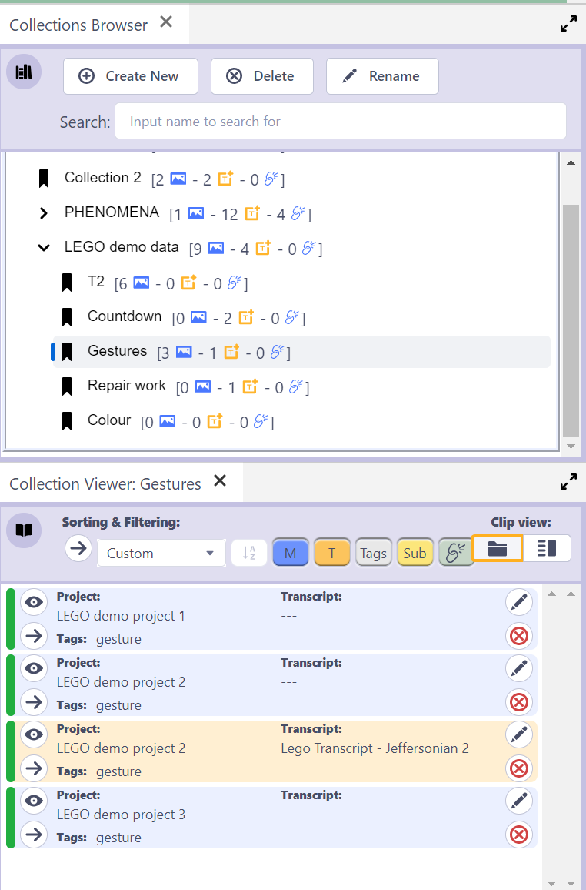

## How to use Clip Collections

You can create any number of collections of clips.
And these collections can be embedded inside other clip collections, which inherit the sub-collections clips.

Collections can be created, moved, deleted and renamed within the Collections tree.

Thus, this tool allows you to organise all your clips (across all your DOTEspaces).

Note that at present only the Clips in Clip Collections in the exported DOTEspace can be included in the export.
Clips from other DOTEspaces will be discarded in the exported archive.

## Collections Browser

The [Collections Browser](collections-browser.md) displays the collections and sub-collections across all your DOTEspaces.

## Collection Viewer

The [Collection Viewer](collection-viewer.md) displays the Clips in the current Collection selected in the Collections Browser.