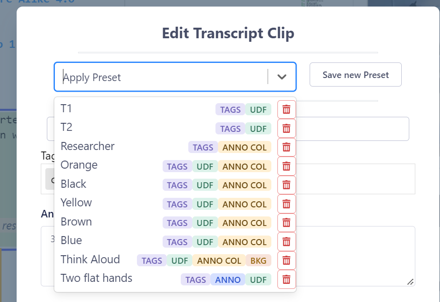
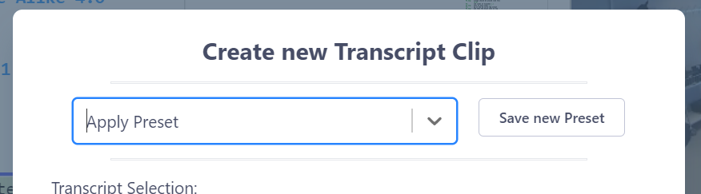
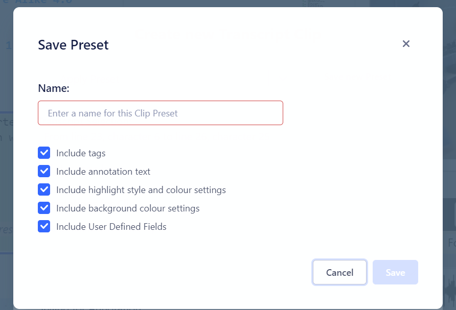

## How to use Clip Presets

Because one often repeatedly creates [Clips](clips.md) with a similar style and/or meta-data in a [DOTEspace](dotespace.md), then we offer Clip Presets that you can set up and apply when making a new Clip or editing an existing Clip.
This should speed up your workflow and allow you to focus on qualitative analysis.

Clip Presets can be created for [Transcript Clips](transcript-clip.md) and [Media Clips](media-clip.md), though they can be applied universally to both Clip types in a DOTEspace.

Saved Clip Presets indicate which of five style and meta-data elements have been saved:
1. Tags (TAGS) - all tags are saved when a Preset is created
2. Annnotation (ANNO) - the annotation text field is saved when a Preset is created
3. Annotation Colour (ANNO COL) - the status and value of the Visual Style + Highlight colour is saved when a Preset is created
4. Background (BKG) - the status and value of the Background colour is saved when a Preset is created
5. User-defined Field (UDF) - all user-defined fields are saved when a Preset is created

The fundamental principle of Clip Presets is that they are applied on top (overlay) of the current Clip's style and meta-data.
Thus, if a Clip Preset has a specific value saved, then it will overwrite the value in the current Clip.
However, if a Clip Preset does not have a specific value saved, then the current value in the Clip will not be replaced.
For example, if a Clip Preset has a specific Highlight (eg. Annotation Colour + status and Visual Style) saved, but not a Background Colour, then the Visual Style and Annotation Colour (and status) will be applied, but the Background Colour will not.

### Creating A Clip Preset

At the top of the Clip dialog box is a section for Clip Presets.

1. To create a Clip Preset, one must have a Clip open.
This could be a Transcript Clip or a Media Clip.
Also, it could be a new one or an existing one.
2. If the meta-data and style settings are to your liking, then click `Save new Preset` button.
3. Enter a unique name for the Preset.
4. Select which elements are to be saved in the Preset.
The default is all.

The new Preset will appear at the bottom of the list of available Presets.
The list order cannot be changed.

### Applying a Clip Preset

If you have saved one or more Clip Presets, then they are available to apply every time one creates or edits a Clip.

1. Select the Apply Preset drop-down menu.
2. In the list, you will see a list of Presets ordered by creation date.
3. The type of meta-data that has been saved and that will be applied is shown.
4. Select the Clip Preset to apply.
5. Changes will be made to only those elements in the Clip that were saved in the Preset.

### Deleting a Clip Preset

1. To delete a Preset, open a Cip or create a dummy clip.
2. Select the Apply Preset drop-down menu.
3. In the list, you will see a list of Presets ordered by reverse creation date.
4. Click the Delete icon to remove the Preset(s).

Note that deleted Presets are not recoverable and that deleting them does not affect any existing Clips.

### Editing a Clip Preset

To edit a clip, one could create a dummy Clip, apply the Preset to be edited, tweak the meta-data and then save as new Preset.
The original Preset can be deleted.
This is clumsy, but at present there is no Clip Preset Manager implemented.

### Strategies for using Clips Presets efficiently

Here are some tips:

- To create a new Preset without creating a Clip, one could create a dummy Clip and tweak the meta-data, then save as new Preset.
The dummy clip can be cancelled.
- One could create a set of Clip Presets that one uses often to quickly assign the correct meta-data and style to a new Clip.
- One could also create a set of Clip Presets that can be applied one after another.
This is useful when there are different collections of elements that could be applicable, eg. one could apply the correct Preset for Tags only, followed by the correct Preset for Highlight colour.
This gives more flexibility with fewer Presets.
- Note that Highlight and Background elements in a Preset save the status of the colour, ie. is it toggled on or off.
