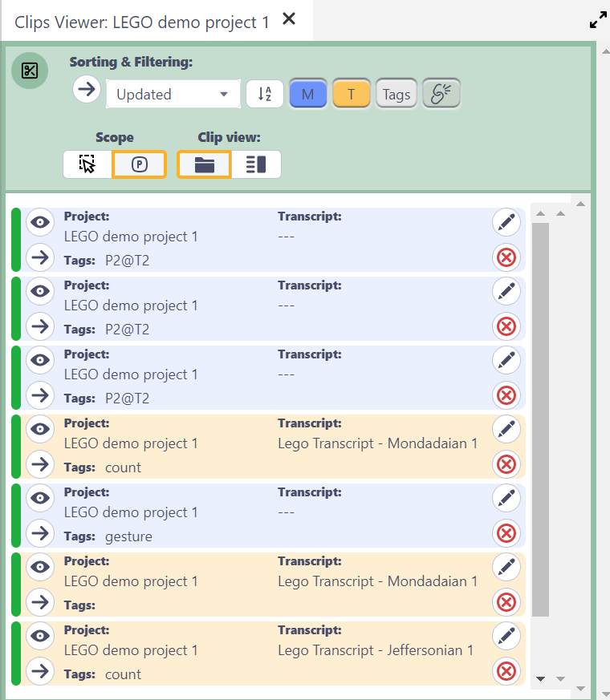
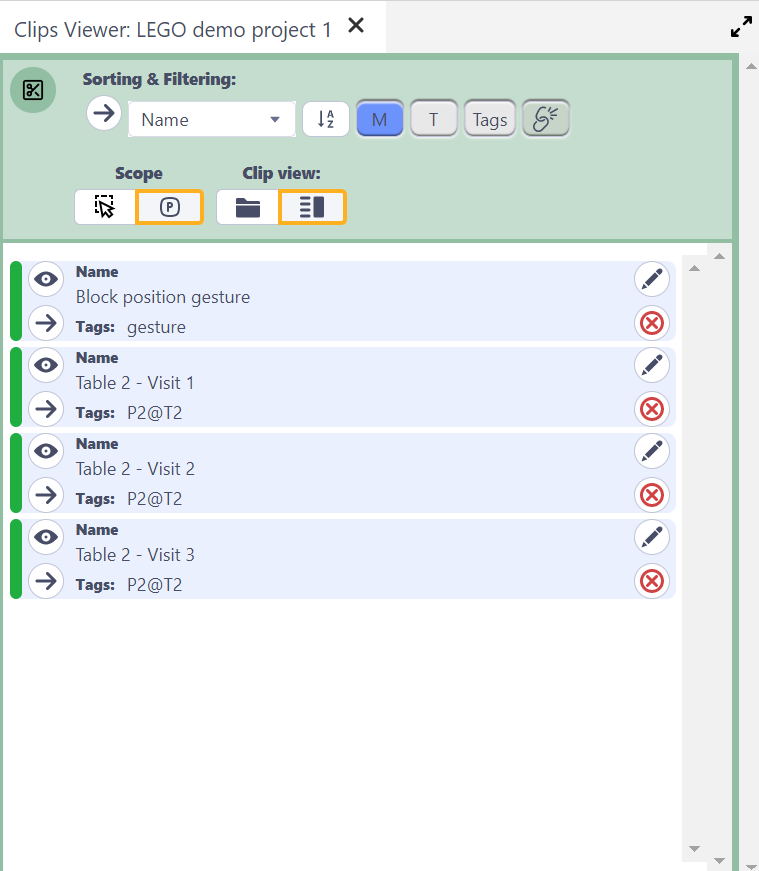

## Using the Clips Viewer

Watch [video tutorial](https://www.youtube.com/watch?v=V2u4gEvL2aM) on YouTube.

Any clips created in the current selected _DOTE_ Project or across selected Projects will be displayed in the Clips Viewer.
Only media clips in that Project and transcript clips in any Transcript in that Project will be listed.

### Viewing Clips in the current Project

The simplest view is afforded by the "Project" Scope (button).
Only Clips in the currently viewed Project are displayed.

### Viewing Clips in all selected Projects and Ttanscripts

Alternatively, one can change the Scope to "Selected Projects and Transcripts" (button).

- First one has to select multiple Projects/Transcripts by pressing SHIFT or CTRL and clicking on the desired Projects and Transcripts listed in one or more DOTEspaces in the DOTEspace panel.
- All Clips from that selection are then displayed in the Clips Viewer.
- Note that one can select Projects, Transcripts, Transcript Clips and Media Clips from more than one DOTEspace.
This is because [Clip Collections](clip-collections.md) can contain Clips from more than one DOTEspace.
- Note that if one selects a Transcript Clip or a Media Clip than all Clips will be shown from the parent Transcript or Project, not just the Clip selected.

### Changing the Clip view

The list relevant Clips can be shown in two views:

1. Standard Project/Transcript information.
2. User-defined information.

### Sorting and Filtering the view

Clips can be sorted in four ways:

1. Custom - the list can be rearranged in any order
2. Updated - by last modified
3. Name - by user-defined name value
4. Chronological - ordered according to the timestamp of M-clips and line number of T-clips

Clips can be filtered in the following ways:

- Include/exclude Media Clips
- Include/exclude Transcript Clips
- Include/exclude sub-collections
- Show only clips with/without tags
