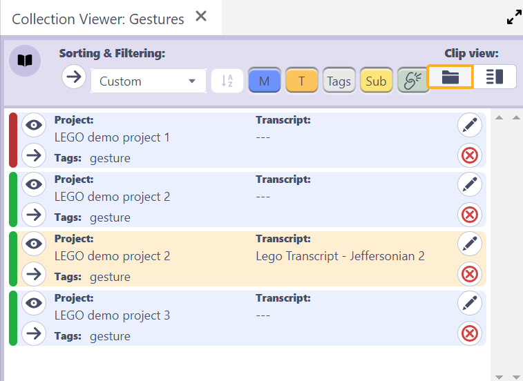

## How to use the Collection Viewer

Watch [video tutorial](https://www.youtube.com/watch?v=9syoogYN0kI) on YouTube.

When a [Clip Collection](clip-collections.md) is selected in the [Collections Browser](collections-browser.md), the Collection Viewer lists all Clips in that Collection.

### Clip views

Two clip views are available.

1. Show Project & Transcript source
2. Show Clip custom fields, eg. user-defined values/names.

### Sorting and filtering

Clips can be sorted in four ways:

1. Custom - the list can be rearranged in any order
2. Updated - by last modified
3. Name - by user-defined name value
4. Chronological - ordered according to the timestamp of M-clips and line number of T-clips

Clips can be filtered in the following ways:

- Include/exclude Media Clips
- Include/exclude Transcript Clips
- Include/exclude sub-collections
- Show only clips with/without tags