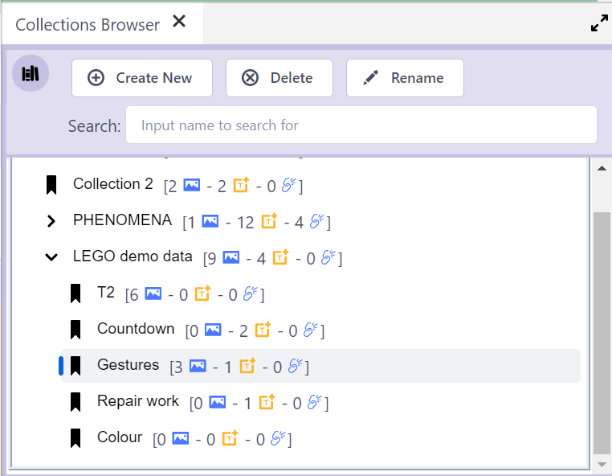

## How to use the Collections Browser

The Collections Browser displays all the available Clip Collections in the current DOTEspace.

All your Collections are listed in this Browser.
Each Collection can include Clips from any DOTEspace.

### Add a new Collection

- A new Collection can be created with the `Create New` button.
- The new Collection is added to the end of the list of Collections.
- Collections can contain sub-collections (parent-child).
Click the right angle bracket ">" to expand the subcollections.
- Each Collection lists the total number of clips and the number of T- and M-Clips in the Collection and all subcollections.
- One can search for a collection name provided the collection is currently listed/expanded.

### Delete a Collection

- A selected Collection can be deleted with the `Delete` button.

### Rename a Collection

- A selected Collection can be renamed with the `Rename` button.

### Move a Collection in the tree

- Collections and subcollections can be dragged and dropped in the Collections tree.
- Collections can be reordered.
- Collections (with their subcollections) can be move up or down the tree hierarchy.
The parent collection in which it is dropped inherits all Clips in the child Collection and all subcollections.
