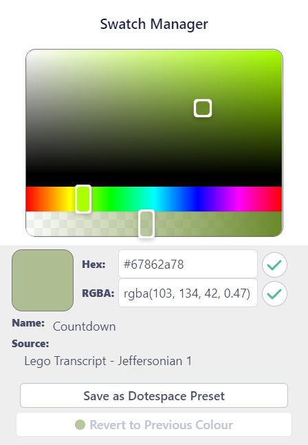
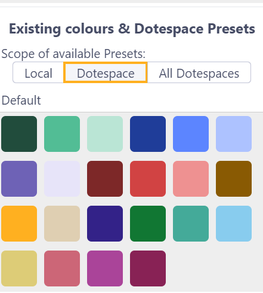
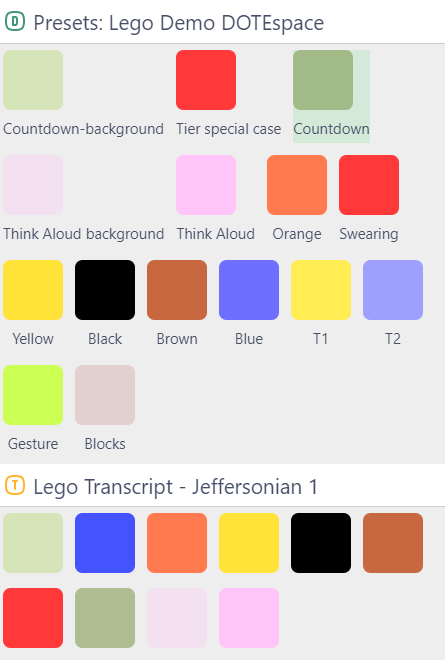

## Colour Swatch Manager

The Colour Swatch Manager manages the Colours that are available in and across DOTEspaces in regard to Clips and Tiers.

To open the Colour Swatch Manager, click on the colour swatch when editing a T-Clip or an M-Clip, or for a Tier in the Settings for the Media Clips Organiser.
A panel opens up on the right side.

A colour can be selected by clicking on the colour wheel, entering a value or clicking on a swatch.
The primary swatch will change colour to the value selected.

If you wish to return to the previous colour before experimenting with swatches in the Manager, then click the `Revert to Previous Colour button` when applicable.

The Colour Swatch Manager has two sections:
1. The top shows the colour wheel, HEX/RGB numbers and the options to create/edit a Preset.
2. The bottom lists the Default Colours and the Swatch Presets, as well as any Colours/Presets in relevant DOTEspaces, Projects and Transcripts.

Right clicking on a Preset gives a menu of choices, including renaming and deleting the Preset.

### Default Colours

Users can use a full range of colours to label their [Clips](clips.md) and [Tiers](media-clips-organiser.md).
The colours can be chosen from a colour wheel or entered using its HEX or RGB value and clicking the save button (tick).
For some functions, a transparency value (RGBA) can be selected to avoid one T-Clip occluding another in the Transcript.

The user can also select from a Default set of Colours listed as Swatches that are always available when using _DOTEbase_.

### Using Preset Colours

An alternative is for the user to create named Colours as Presets and assemble them in a separate Swatch palette at the DOTEspace level, ie. your presets are available for any Clip or Tier in a single DOTEspace, though they can be applied in other DOTEspaces later.
To save the current colour displayed in the primary swatch, click `Save as DOTEspace Preset` and enter a unique name.
Select a DOTEspace to save the colour to and click `Save`.

Note that Presets do not apply to the Canvas colours.

### Scope of Colour Swatch Sets

The currently active Colours, including Default, user-specified and saved Presets, can be viewed by scope, eg. locally and by DOTEspace:
- Only those in the local Transcript or Project are shown.
- Only those in the current DOTEspace are shown.
- All are shown across all DOTEspaces.

An indication of the scope of any set of swatches is indicated by an icon, eg. `D` for DOTEspace, `P` for Project and `T` for Transcript-Clip.

Swatch sets are also divided into saved Presets in the DOTEspace and those in local Transcripts or Projects in the current DOTEspace.

It is not possible to filter or sort in any other way (yet).

### Exporting and Importing Colour Presets

Colours and Swatch Presets assigned in a DOTEspace are exportable and importable with that DOTEspace.

Note that if you share an exported DOTEspace with someone else and they import it and they wish to use colours when adding/editing Clips and Tiers, they can also use the Presets you have defined in that DOTEspace.
If they send you an exported DOTEspace (after editing), then when you import that DOTEspace, the same Presets will be present, but in the new DOTEspace (they cannot be merged).
However, if they change a Preset colour or delete it, then those Presets will either not match the original Preset or not be present in the imported DOTEspace.