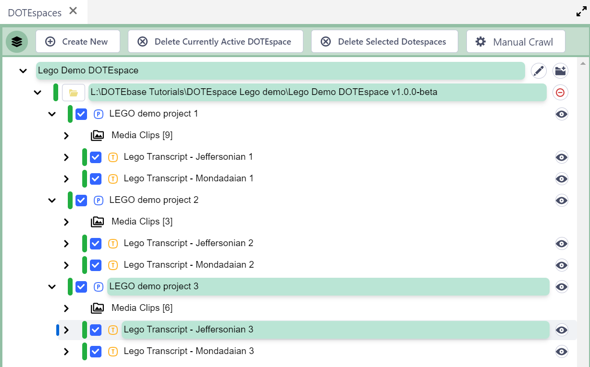

## How to use the Lego Demo DOTEspace

Watch [video tutorial](https://www.youtube.com/watch?v=SCAQFpx7ZdE) on YouTube.

The Lego Demo DOTEspace is an artificial working DOTEspace designed to show off many of the features of _DOTEbase_.

The Demo contains the original Lego Demo Project data, which can be downloaded for _DOTE_ separately.
However, the media files and the transcripts have been split into 3 separate _DOTE_ projects.
Doing do enables us to demonstrate how _DOTEbase_ can work with independent _DOTE_ projects and transcripts (in a single DOTEspace) that are spread out on the file system.

At present, only one DOTEspace can be [exported and imported](export.md) at one time.

### How to download and import the demo DOTEspace

Download the demo DOTEspace from the [webshop](https://www.dote.aau.dk).
You will need to make sure you have enough space for the download (1.7GB) and the same again to import it into _DOTEbase_.
After import, you can delete the downloaded file.

1. Select `Import` from `File` menu.
2. Locate the file that you downloaded and import.
3. The DOTEspace should appear in the list of DOTEspaces in the DOTEspaces panel.
4. Have fun exploring the demo!

### What is the content in the Lego Demo DOTEspace?

The Lego Demo DOTEspace consists of the following structure:

- Lego Demo DOTEspace (one watch folder)
    - LEGO demo project 1 (including all active media)
        - Media Clips
        - Lego Transcript - Jeffersonian 1
            - Transcript clips
        - Lego Transcript - Mondadaian 1
            - Transcript clips
    - LEGO demo project 2 (including all active media)
        - Lego Transcript - Jeffersonian 2
            - Transcript clips
        - Lego Transcript - Mondadaian 2 (blank)
    - LEGO demo project 3 (including all active media)
        - Lego Transcript - Jeffersonian 3
            - Transcript clips
        - Lego Transcript - Mondadaian 3 (blank)

There are roughly 50 [Transcript Clips](transcript-clip.md) and 15 [Media Clips](media-clip.md) spread over all the Projects and Transcripts.

- Roughly 10 [Tags](tags.md) have been used to tag the Clips.
- All the Clips are assigned a user-defined field `Name` that contains a short description.
- Emojis have been used in some of the Tags and Name fields.
- The Media Clips are organised in Tiers in the Media Clips Organiser.
- Note that some of the Transcripts are shells with no content (just some meta-data).

Included in the Demo is a small set of [Clip Collections and Sub-Collections](clip-collections.md), which each contain some Media and Transcript Clips.
Note that parent Collections contain all the Clips of Sub-Collections, yet the parent can contain clips that are not in the Sub-Collections.

Included in the Demo are several [Colour Swatch Presets](colour-manager.md) and some [Clip Presets](clip-presets.md).
These are available when creating/editing a Clip.

Also included is a [Canvas](canvas.md) populated with Clips and Connectors, boxes, shapes, etc.
We recommend that you import it, too.
