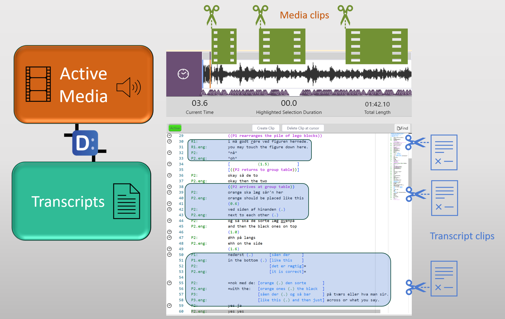

## How to setup _DOTE_ Projects and Transcripts

To be able to create a [DOTEspace](dotespace.md) in _DOTEbase_, one must have already prepared or imported one or more _DOTE_ Projects somewhere on you file system.

If one is just starting with some audio-visual data corpus, then each 'event' with all its associated synchronised media files must be imported into new _DOTE_ Projects.
_DOTE_ will automatically create a blank Transcript for each Project, but you don't need to start work on transcribing at this early stage.
Remember that _DOTE_ works with discrete, temporal 'events', which means that all of the scanned Projects in a DOTEspace represent continuous strips of social conduct, though they do not have to be related events or recordings of social conduct.
For example, one can include in a single DOTEspace video and audio recordings from multiple settings and research projects.
All that is required, is that ALL media files are pre-processed by importing them into _DOTE_ Projects.

The diagram below shows how DOTE Projects contain the media and transcripts that are clippable.

See the help guide for _DOTE_ for how to [create and maintain _DOTE_ Projects](https://bigsoftvideo.github.io/DOTE/projects.html).
