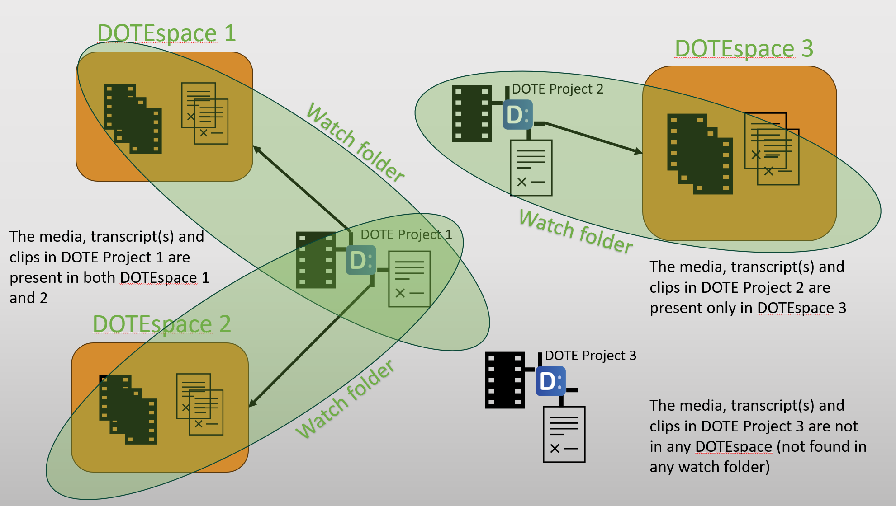

## How to setup a DOTEspace

Any number of DOTEspaces can be created using the DOTEspaces panel.
Each DOTEspace is assigned one or more Watch Folders in which DOTE Projects and Transcripts are scanned and loaded as a snapshot into _DOTEbase_.
Instead of creating a relational database containing all the Projects, Media, Transcripts, Clips, Tags etc in one place, the information is stored locally in each Project using transparent data structures.
This allows users to move their Projects, Media and Transcripts around without losing their Clips, Tags etc.
It decouples the Clips, Tags, etc from _DOTEbase_ and thus allows other software to access this data freely and easily (on the same computer with access granted) and support Clips, Tags, etc.

### Creating a new DOTEspace

_DOTEbase_ automatically scans all Watch Folders in all DOTEspaces for updates.
This is called crawling because _DOTEbase_ must look in all files, folders and subfolders in every watch folder.
This is necessary so that any changes found in the Watch Folders can be incorporated into the current snapshot.
If required, the user can manually start the crawl using the button at the top of the DOTEspace panel.

More than one Watch Folder is allowed in any DOTEspace so that users can keep their DOTE projects/transcripts in multiple locations and on external mapped drives.
Initially, all of the _DOTE_ projects/transcripts under each watch folder (including subfolders) are included in the relevant DOTEspace.
Individual projects and transcripts can be removed once the DOTEspace is scanned by toggling them off in the DOTEspace viewer.

It is important to appreciate the [scope of a DOTEspace](scope.md) in _DOTEbase_.

Because _DOTEbase_ scans watch folders that can be distributed across your file system, sometimes a drive or folder is not currently accessible.
_DOTEbase_ keeps a record (cache) of the last known folders/files and their location.
In the DOTEspace panel, Projects and Transcripts that have been found in watch folders can have different statuses (colour-coded), namely found/scanned, not found, inaccessible...

In the DOTEspace panel, Media and Transcript Clips can have different statuses (icons), namely original, copy or not found.

### Deleting a DOTEspace

When a DOTEspace is selected in the DOTEspaces panel, it can be deleted using the `Delete Current DOTEspace` button.
The DOTEspace will be removed from the panel, including its watch folders.
It is not recoverable.

### Notes

NOTE that DOTEspaces are not encrypted on your computer.
_DOTEbase_ stores all data and meta-data in plain text in files on your computer.
If you wish to encrypt the data, then use software or hardware encryption on the relevant drives/folders as required.

NOTE that nothing is uploaded to the cloud by _DOTE_ or _DOTEbase_.
The only data stored is on your computer in the drives and folders you specify and the application folder.
