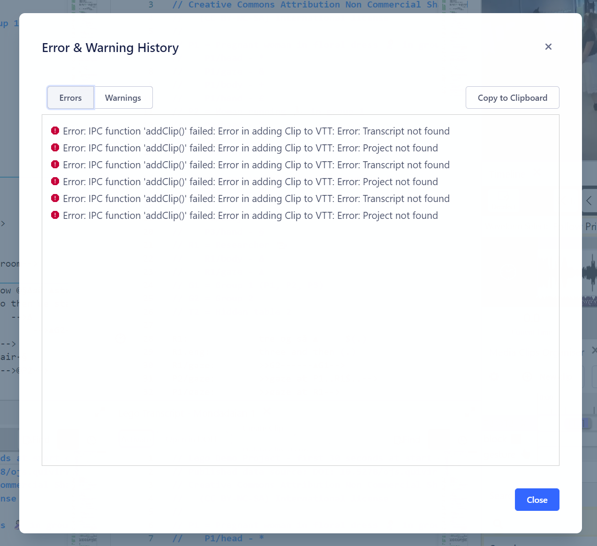

## Warnings and Errors

Sometimes _DOTEbase_ reports errors and warnings.
These often appear temporarily at the top of the window and then disappear.
There is a log of these errors and warnings under `Help/Shows Recent Errors and Warnings` menu item.

Some of the errors and warnings may not make much sense.
You can copy the errors log and the warnings log to the clipboard and paste into an email or message for the developers.

### Log files

If you are reporting a problem to the developers, then it may be useful to send the log files as well.

- Click `Help/Open Log File Directory` in the menu bar.
- The last known text log file will open in a plain text editor.
You can see the date/time in the log filename.
- Save this file to a new location.
- Send the saved file to the developers.
