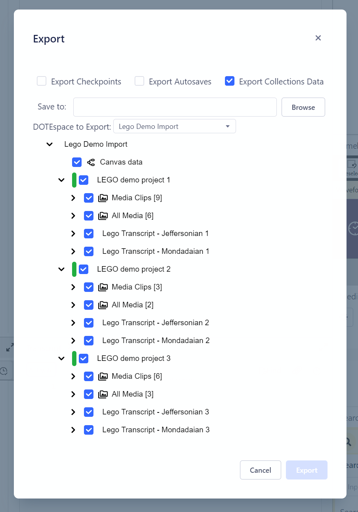
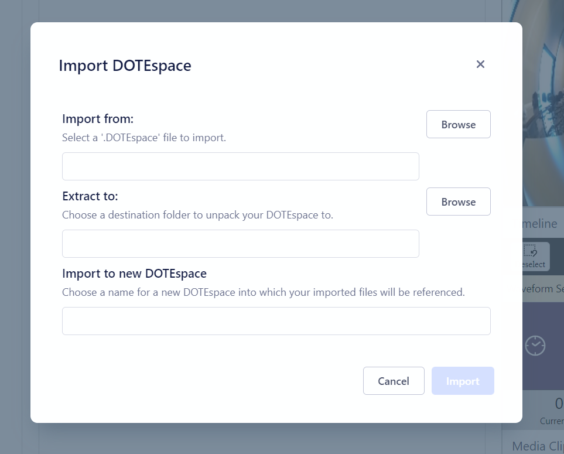

## Exporting and importing a DOTEspace

A single DOTEspace can be exported and shared with others.

An exported DOTEspace can be imported into DOTEbase by another user.

### How to export a DOTEspace

1. Select File/Export DOTEspace.
1. Select the Projects/Transcripts and/or Media/Transcript Clips that you would like to export in the DOTEspace.
The default is ALL.
    - You can also choose to include/exclude Checkpoints and AutoBackups associated with each Transcript (see _DOTE_ for more details).
    - You can also select to export the Canvas and Clip Collections.
1. Select `Browse` to find a location for the archive file to be generated.
2. Select `Export` and choose a filename.

NOTE that if any Projects/Transcripts are not online at the moment (eg. the drive is not available), then a cached version will be exported.
The inaccessible Project/Transcript(s) will be marked with a red bar (see above).

NOTE that if there are any clips from other DOTEspaces in Collections associated with a DOTEspace to be exported, then those external clips will not be exported.

NOTE that an exported DOTEspace is not encrypted.
If you share it with someone else, then all the media files and any Transcripts are openly accessible.
If this concerns you, then encrypt the DOTEspace export file using your preferred hardware or software encryption.

### How to import a DOTEspace

1. If you have received a DOTEspace archive file, then select `File/Import DOTEspace`.
1. Locate the file on your file system.
1. The Projects/Transcripts and Transcript/Media Clips that are found in the archive will be listed.
1. You can also select if you wish to import the Canvas and Clip Collections as well.
1. Select the location on your file system that you would like the DOTEspace to be unpacked.
1. Enter a unique name for the imported DOTEspace.
1. The DOTEspace will be added to your list of DOTEspaces.
