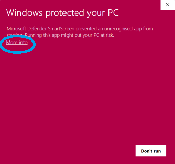
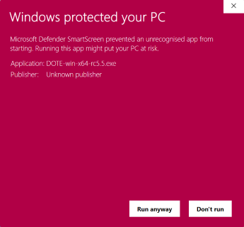
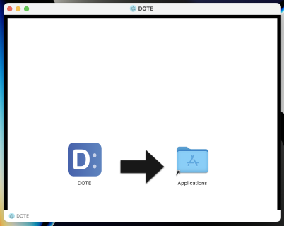
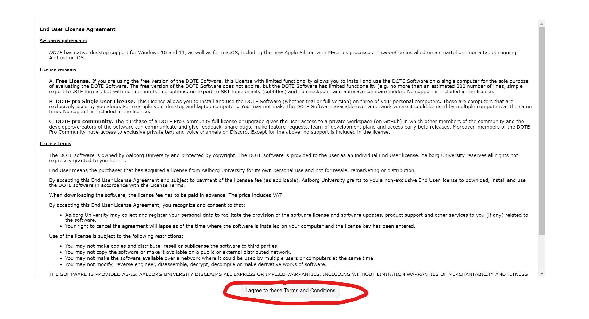

## How to download and install _DOTEbase_

_DOTEbase_ is a desktop application that runs on your local computer.
It is very easy to download, install the software and run it on the Windows and Mac desktop platforms.
It should run on the latest versions of Microsoft Windows 10 or 11 and also Apple macOS (10.10 Yosemite or later; also macOS 12 for the newer Apple Silicon M-series).
Let us know if you have a problem installing and running _DOTEbase_ on these platforms.
Theoretically, it should also run on Linux, but we don't support this.
Contact us if you are interested in using _DOTEbase_ on this platform.
Note that only one instance of _DOTEbase_ is allowed to run at the same time.

Choose the latest version for your operating system from our [DOTEbase beta release GitHub repository](https://github.com/BigSoftVideo/DOTEbase-beta-testing/releases).
You need to have an account on GitHub and that account be assigned to the repository for this link to work.
Contact us on Discord if you have problems.

You will also need to update _DOTE_ to a beta release.
The current beta release is also listed for download on the GitHub site.

- **Windows**
  - To install the Windows version, `double click` on the `EXE` file.
  - If you get a Windows warning message, then click the `More info` link, and choose `RUN ANYWAY`.
  - _DOTEbase_ will start after the install is complete.
  - The _DOTEbase_ icon should also appear on your desktop.
    In future, just `double click` the icon and _DOTEbase_ will start.

- **macOS**
  - For macOS, double click on the _DOTEbase_ icon (`DMG`).
  - Drag and drop the unpacked `DOTE` app into your `Applications` folder and `double click` to run.
  - NOTE: your macOS system settings may be set to restrict installations.
  - In that case, open `System Preferences`, select `Security & Privacy`, select `General` tab, and select and approve `Allow apps downloaded from`App Store and identified developers`.
    You may need to _unlock_ your settings to make these changes.

### End User License Agreement

The first thing you need to do after installing _DOTEbase_ is agree to the Terms and Conditions of the EULA.

If you do, then _DOTEbase_ won't ask again on that machine.
If you don't, then _DOTEbase_ will not start.

### Installation problems 

On Windows, the installation may fail because Windows Defender does not recognise the software.
You can set Defender to allow _DOTEbase_ to run on your computer.

On Windows, the installation may fail because your Windows setting does not allow software to be installed except from the App Store.
If you wish to install _DOTEbase_, then you have to change that setting to allow apps to be installed from 3rd party sources.

Another reason for failure is that you may have an Anti-virus/malware programme installed.
It may not recognise _DOTEbase_ and warn you about installing/running the software on your computer.
Just set the Anti-virus software to trust _DOTEbase_.

If the installation fails because you do not have administrator rights, then you may need to get permission from your IT support to allow installation of the _DOTEbase_ software.

- For example, you may not have permission in Windows (Group Policy) to install unknown or unapproved software.
This is a local problem with how your computer has been setup by a security conscious IT support.
  - Ask your system administrator to allow running `DOTE_ExecutionStub.exe` AND `DOTE.exe`.
    The installer must be run after this has succeeded, then you should be able to run _DOTEbase_ normally.
  - Alternatively use _DOTEbase_ on a computer that is not constrained by such policies (for example a computer that you own personally).

### Installing other open source packages that _DOTEbase_ needs for specific purposes

#### Installing FFmpeg 

_DOTEbase_ relies on _DOTE_ to create audio waveforms when a project/transcript is created and video/audio files are imported.

Refer to _DOTE_'s help guide for more information. 

### _DOTEbase_ license key

You will need to purchase and enter a _DOTE Pro/Pro Community_ [license key](https://bigsoftvideo.github.io/DOTE/pro.html#license) to unlock _DOTEbase_.
_DOTEbase_ does not have its own license key.

Follow the [activation instructions](license-activation.md) for _DOTEbase_.

### Updating to a new release

When you run _DOTEbase_, it will remind you if there is a new release available online.
It is up to you to manually download the new release and install it.

To update _DOTEbase_ on both operating systems, just close _DOTEbase_, download the update and follow the same procedure above.
_DOTEbase_ will be updated and restart automatically.

NOTE: It is best to close _DOTEbase_ and _DOTE_ prior to updating either software.
_