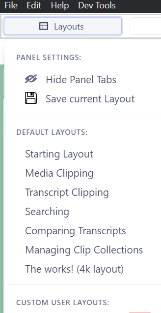

## DOTEbase layout and user interface

The _DOTEbase_ UI has a lot of flexibility.
Panels can be added and removed, resized and relocated in relation to other panels.
Also, some panels can have multiple instances, eg. Transcript and Search panels can have more than one instance, so that one can start multiple searches at the same time or open multiple transcripts simultaneously.

For ease of use, _DOTEbase_ should restore the last used layout every time when restarts _DOTEbase_.

To enlarge or shrink the default font size for the whole user interface, then use the function keys `F9`/`F10`.

### Predefined layouts

There is the option to switch between several predefined layouts.

- Click the `Layouts` button and a menu will appear.
  - Panel settings - Panel Tabs can be hidden to get more screen estate.
  - Default layouts - A list of predefined layouts for specific tasks common to all DOTEbase users.
  - Custom user layouts - The current layout can be saved as a custom layout.
Custom layouts are listed and can be deleted.

Predefined layouts include:

- _Starting_ layout - to get started for readability when screen estate is limited
- _Media clipping_ layout - just for clipping media sources
- _Transcript_ clipping layout - just for clipping transcripts
- _Searching_ layout - to prioritise search panels
- _Comparing Transcripts_ layout - great for comparing multiple transcripts in panels side-by-side or over-under
- _Managing Clip Collections_ layout - for working on your clips and collections
- _The Works!_ High resolution screen (4K) - the kitchen sink!

Later we will allow users to export and share their own layouts.
We encourage trading in layouts for specific purposes.

### Panels in layouts

The _DOTEbase_ user interface is very flexible.
Users can open/close and rearrange panels to find the best configuration for the task at hand on the display available.

Some panels can contain multiple instances in tabs, eg. `Transcript` or `Search`.

Panels can be opened by clicking the relevant button in the top bar, eg. `Layouts` or `DOTEspaces`.
The panel will appear in one of several locations:
- The currently selected panel.
- The appropriate panel, eg. new Transcript panels are opened in the parent Transcript panel is a new tabbed instance.

NOTE that in Zen mode individual panels can be expanded to be the only panel open in your _DOTEbase_ layout.
Click on the expand button on the top right of every panel.
To shrink back to your current layout before zooming in, click the shrink button.

### Panel names

Some panels will display the source of the contents of the panel:

- Transcript panels will display the source Transcript
- Project Clips Viewer will display the source Project
- Collection Viewer will display the source Collection name

### Resizing panels

Panels and panels in tabs can be resized.

- To resize a panel, grab the handle one of the edges of the panel and drag and drop to resize.
- Other panels will be resized as well to fit.

### Moving panels

Panels and panels in tabs can be relocated (and resized accordingly).

- To move a panel to a new location, click on the panel HEADER and drag.
- As one drags the panel over other panels, a grey block will show a possible new location.
- As one drags the panel onto the header of another panel, the panel can be added to that master panel as a new tab.
- Drop the panel and it will move to the selected location.
 
