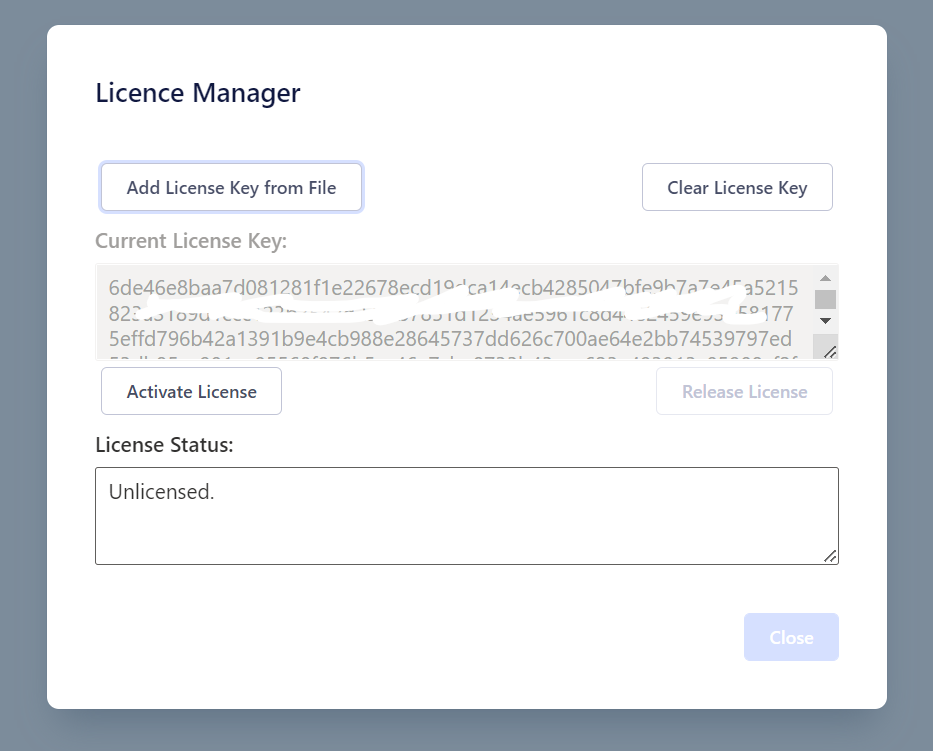

## Activating _DOTEbase_

_DOTEbase_ activated with a PRO or PRO COMMUNITY Edition license, the same license is used to activate _DOTE_.

Such a license is granted for access to the current released version of _DOTEbase_, including hotfixes and minor updates (eg. from `v1.1` to `v1.2`).
With each new major release (eg. from `v1` to `v2`), a new license or an upgrade is required.

Go to our [WEBSHOP](https://www.dote.aau.dk) to purchase a license and read more information about Editions.

### _DOTEbase_ license activation 

To unlock _DOTEbase_, you will have to do the following:

1. If you haven't already done so, [purchase a license](https://www.dote.aau.dk/license-compare).
2. You will receive the license key in an email message.
3. Download the license key file to your computer on which you have installed the latest version of _DOTEbase_.
4. From the `Help` menu, select `License Manager`.
5. Select `Select License Key from File` and browse for the license key file on your computer and select it.
6. Click `Activate License`.
_DOTEbase_ will check with the license server online.
1. If the license file is registered, and there are unfilled device slots, then _DOTEbase_ will be unlocked.
2. The email address of the license key holder will appear in `Current License Status` box.
And the name associated with the license will appear in the title bar of the application.

#### Notes

- One license can unlock _DOTEbase_ on the same or another computer (device) owned by that user.
- The same license file is used to unlock an extra device assigned to your license (3 slots).
Remember that _DOTE_ and _DOTEbase_ activation share the same license, and each takes up one slot.
- Normally, PRO and PRO COMMUNITY Edition users are allowed to install software on up to 3 devices.
_DOTEbase_ will take one of those device slots.
- If all three license slots are full, then one slot will have to be released so that _DOTEbase_ can receive that free slot.
You can release a device that has a license key already installed.
Open _DOTEbase_ and go to `File/About/License Manager` and select `Release License`.
If all your device slots are full, and you cannot unregister any of the devices because they are unavailable, then contact us explaining the situation (dote-license@id.aau.dk).
- If you wish to enter a different licence key, then select `Clear License Key`.
This is useful if you are sharing a computer or you have purchased a new license.
- If, for whatever reason, an updated license key is available for the current user (identified by email), then the user will be informed when _DOTEbase_ runs.
