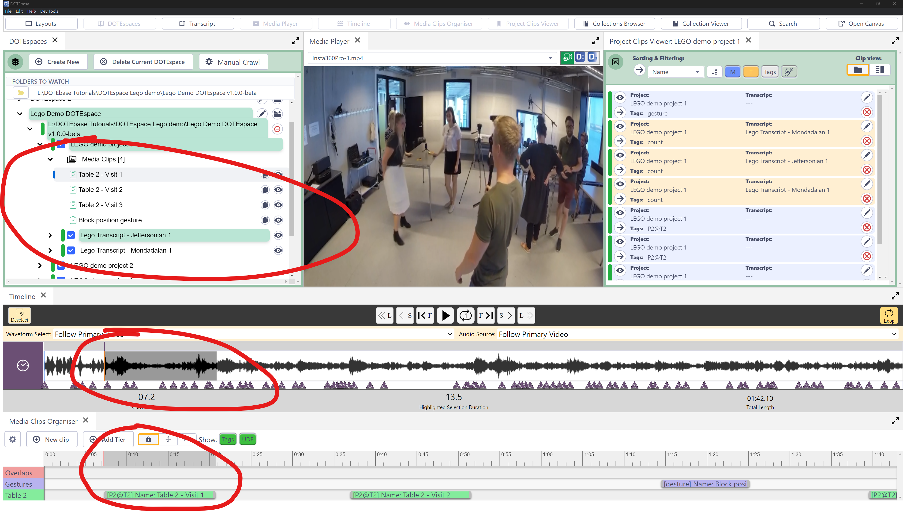

## How to make Media Clips

Media Clips (or M-clips) are indexed between and IN and OUR point in a media source found in a _DOTE_ project in the current DOTEspace.
Thus, it represents a fixed duration of a clip within a media source.

Here are the steps to create a media clip:
1. Locate and view the media source in which you wish to make a clip.
This can be done by browsing the Projects listed in the DOTEspace panel.
1. Make sure the Media Player, the Timeline and the Media Clips Organiser panels are open.
1. The Media Player will play the audio or video.
You may wish to select the best view mode from the toggle in the top right of the panel.
1. Use the mouse to draw a highlighted segment in the Timeline waveform.
You may wish to adjust the waveform zoom to get a more accurate selection.
1. Add New Clip from the Media Clips Organiser.
You will need to add Tags and Comments if relevant.
You may also wish to select a current or create a new Tier on which to place the Clip.
