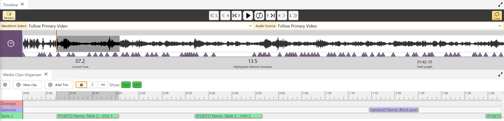
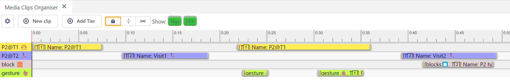
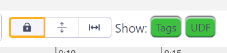

## How to use the Media Clips Organiser

Watch [video tutorial](https://www.youtube.com/watch?v=lfchHBD4PUM) on YouTube.

Media Clips can be created and edited from the Media Clips Organiser panel.

A key feature of the Media Clips Organiser is the ability to create Tiers to which Media Clips can be assigned.
This feature allows users to create [colour-coded](colour-manager.md) channels to better visualise individual clips in the Timeline.
Note that these have nothing to do with Transcripts and are not a form of score-based transcription (such as found in _ELAN_).

### Organising Media Clips

- Any number of Tiers can be created (Name and [Colour](colour-manager.md)).
- Use the Settings in the Media Clips Organiser to adjust the colour and order of the Tiers.
- Media Clips can be assigned to any Tier.
- Clips can be moved between Tiers using the Tier Mode.
- Clips can be locked using the Tier Mode to avoid accidental movement or adjustment.
- Clips can be adjusted in length using the Adjust boundaries Tier Mode.
- Clip details ([Tag](tags.md), UDF) can be shown in Clip objects in all Tiers.

The Tier Mode has three states:
1. Lock Tiers and Clips
2. Enable moving Clips between Tiers
3. Enable dragging Clips along a Tier

Also a naming filter can be applied that shows:
- List of assigned Tags
- User-defined Name field

Note that Media Clips cannot be created, viewed or edited in _DOTE_, unlike Transcript Clips.
