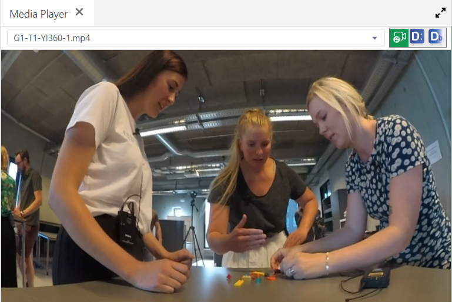
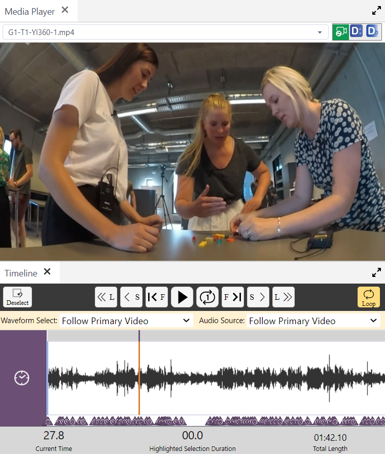
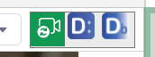

## How to use the Media Player

Watch [video tutorial](https://www.youtube.com/watch?v=w8DEAE_azc8) on YouTube.

The Media Player displays an audio-visual source for playback in _DOTEbase_.
It is very similar to the [media player in _DOTE_](https://bigsoftvideo.github.io/DOTE/play.html).
The video view will be resized to fit the panel.

The Media Player only plays back media in combination with the [Timeline](timeline.md) tool, ie. the Timeline has to be open at the same time in the _DOTEbase_ layout, otherwise only a still image is displayed at the current playhead position.

The source can be viewed in different ways.

1. One format is derived from the [Video-cues](https://bigsoftvideo.github.io/DOTE/cues.html) created in _DOTE_ for the Project in question.
2. Another format is the last known saved view for this media in the Project in _DOTE_.
3. A third format is the last known saved view for this media in _DOTEbase_ itself.
This has no connection to any of the stored views in _DOTE_.

The media can be played using the [same shortcuts and buttons as are familiar in DOTE_](https://bigsoftvideo.github.io/DOTE/play.html).
