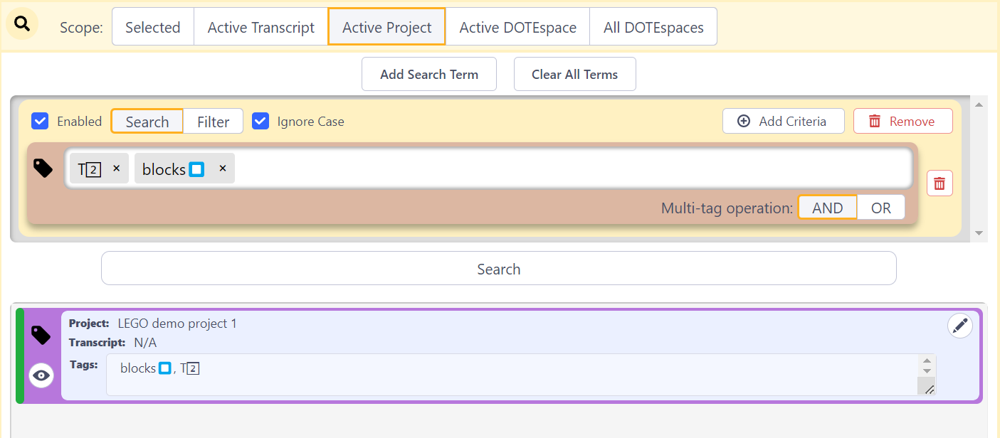

## Searching DOTEspaces

The Search panel allows the user to search across all Transcripts and Clips within the scope of a Transcript, Project, DOTEspace or all DOTEspaces.
Search targets and parameters can be easily combined to enable searches combining AND, OR and NOT.
In addition, multiple Search panels can be opened to conduct multiple Searches at the same time.

Searching requires one or more Targets, with further specification of criteria within the Target.
More advanced searching can, in effect, combine Search Terms and Criteria with the logical operators AND, OR and NOT.
The Search panel is designed to make this easy to use without resorting to regular expressions (RegEx) and complex nomenclature for combining logical operations.

The Search results below are displayed after clicking the SEARCH button.
The height of the Search Terms box can be adjusted using the horizontal slider.

#### Search Terms vs Filter Terms

In the Search panel, a fundamental distinction is made between a Search Term and a Filter Term.
The former searches only for those Targets that are specified in the Search Term(s).
The latter filters out everything in the Search results that matches the Target, ie. it excludes them and therefore acts like a NOT.
For example, SEARCHing for Clips with the "GESTURE" Tag, but FILTERing out Clips that contain the "POINT" Tag, will show all Clips that contain the "GESTURE" tag _and_ do not contain the "BLOCKS" tag.

Note that a Filter is is applied either as a standalone Term or as a Criteria to filter out results from the parent Search Term.
A Filter Term cannot be used on its own in a Search without any other Search Terms.
In practice, the search concatenates all Search Term results, then filters out those results that match the Filter Term.

#### Scope of a Search

The scope of all Searches must be specified at the top of the Search panel.
This means that the Search will be restricted to the following objects in the _DOTEbase_ universe:

- Selected - Only search in those [DOTEspaces](dotespace.md), [Projects](dote.md) and [Transcripts](transcript.md) selected in the [DOTEspaces](dotespace.md) panel
- Active Transcript - Only search in the active Transcript
- Active Project - Only search for Media Clips in the active Project
- Active DOTEspace - Only search in the active DOTEspace. This is the default.
- All DOTEspaces - Search everywhere

### Simple searching

First, a Search Term must be added and a Target for the search chosen.

1. Add a new Search Term using the `Add Search Term` button.
2. Choose a Target.
The possible Targets include Transcripts, Tags, Annotations, User-Defined Fields (UDFs).
Once one of these Targets is chosen, more specific criteria for the search can be entered.

One can start a search straightaway by typing or selecting the Target...

1. Type the search Target as a string of characters in the box.
2. Press ENTER or TAB and it will be added.
3. You can add more than one search Target string.
4. Click the Search button and the results of the Search will be displayed with icon/colour-coded entries.
    - One can view a Transcript or Media Clip in context by clicking the view icon on each result.
    - Such Clips can be edited using the pencil icon.
    - For text found in transcripts, one can click on the line displayed to see a larger 5-line context in a pop-up box.
Or one can click the view icon to see the complete context in the active Transcript panel, in which the search string is highlighted.

When a Search is complete, the user can remove it by clicking the button `Clear All Terms`.
The Search Terms and the Results will be cleared.
There is no undo or save search functionality.

#### Extra criteria in a Search Term

There are a range of options for a Search Term:

1. One can enable/disable a Search Term. The default is enabled.
1. One can enter one or more text strings and choose AND/OR to combine them in a search. The default is OR.
1. One can require/ignore case in the search string(s). The default is ignore.
1. One can change the complete Search Term from a Search to a Filter. The default is Search.
2. One can change the Search element from a Search to a Filter. The default is Search.
3. One can `Add Criteria` to further restrict the Search. See below.

### Specifying Search Targets

The main Target of a Search Term can be specified in more detail.

If there is more than one Target, then there is the option to conjoin them with the logical operator AND or OR.
With AND, all Targets must be found for a successful result; with OR, the presence of any of the Targets is a successful result.
eg. if the Tags "gesture" and "point" are conjoined with AND, then both must be found in a Clip; however, if they are conjoined with OR, then any Clip that has "gesture" or "point" (or both) will be a result.

#### Specifying the Transcript Target

The Transcript Target can be line-based and transcript-based.
In the former case (`Lines`), the search engine scans each line in a transcript(s), and there is a positive hit if a line contains the Search Target.
In the latter case (`Transcripts`), the search engine scans each transcript, and there is a positive hit if a transcript contains the Search Target.
In both cases the lines with hits are returned, but in the latter case it only takes one positive hit for a transcript to be included in the results.
The distinction is useful when applying Criteria to narrow down the search, ie. when each hit is within the scope of a line, then a Filter Criteria can be used to filter out lines that also contain the filter target in the same line.
Whereas if a Filter Criteria is applied to the results on a Transcript context, then all that is required is for the filter target to be present in the same transcript and the hit will be filtered out.

For a fuller understanding of some of these choices, take a look at the _DOTE_ help guide on transcription and subtiers.

- Search in technical comments (//) (or omit such comments from search)
- Search in all designated Speaker lines (or omit such lines from search)
- Search in Subtier lines, eg. translation or gloss (or omit such lines from search)
- Search in `.translation` lines (or omit such lines from search)
- Search in `@gloss` lines (or omit such lines from search)
- Search in `#wildcard` (eg. `#fig`) lines (or omit such lines from search)
- Search in unformatted lines (or omit such lines from search)
- One can also add specific characters to a target in a search that should be ignored.
Just enter them as one continuous string of characters with no spaces (eg. `:[]*><°`).
This is very useful when searching for a lexical item that may include non lexical characters, eg. ":" or "[" or "]".
Thus, one can search for all instances of a word even though it may have one or more instances of colon (":") in it, eg. "yes", "ye:s" and "ye:::s" would all be found.
A few combinations are offered in a drop-down menu.
The suggestions cannot be edited, but if selected, then the string can be edited by the user.

For example, one could search across transcripts in an active DOTEspace to find a specific lexical item and its variants ("yes", "YES", "ye:s" or "Ye::::s") in a Translation Subtier (see example below).

#### Specifying the Tags Target

By clicking in the Tags box, the current set of Tags in the selected Scope will be available to be selected in a drop-down list.

There are no options to further specify the Tags Target.

For example, one could search across an active Project to find all Clips with a specific set of Tags (see example below).

#### Specifying the Annotations Target

There are no options to further specify the Annotations Target.

#### Specifying the User-Defined Fields Target

There are two options:

- Search in Names
- Search in Values

### Filters

Any Search Term (or criteria) can be turned into a Filter.
A Filter is equivalent to the logical operator NOT.
Thus, if a single Search Term is flipped into a Filter, then the results of the Search will include everything in a Search Term that is NOT found by searching for the entries etc.

Note that the whole Search Term can become a Filter, and the specific searchable items or criteria can become a Filter.

### Rich search

_DOTEbase_ provides a powerful search engine that allows the user to narrow down searches.
Not only can all the Transcripts in a DOTEspace be searched simultaneously, so can clips and their meta-data.

#### Adding criteria to a Search Term

One can add specific criteria to a Search Term to narrow down/filter a search.
A criteria that is added to a specific Search Term is equivalent to the logical operator AND.

#### Multiple Search/Filter targets

One can add multiple targets to a single search and combine them, which are combined with the logical operator OR.
Thus, a search for more than one Search Term will show all add up the results that match each Search Term (removing any duplicates).
If there is a filter (NOT), then the filter will be applied at the end to filter from the positive results of the Search.

### Multiple searches

It is possible to have many Search panels open in the DOTEbase window, either as Tabbed Searches or visible Search panels.
Each Search panel is independent.

It is not possible at present to save/load a Search configuration for future use.
Nor is it possible to send all the results of Clips found to a Collection.
These are features in the pipeline.
