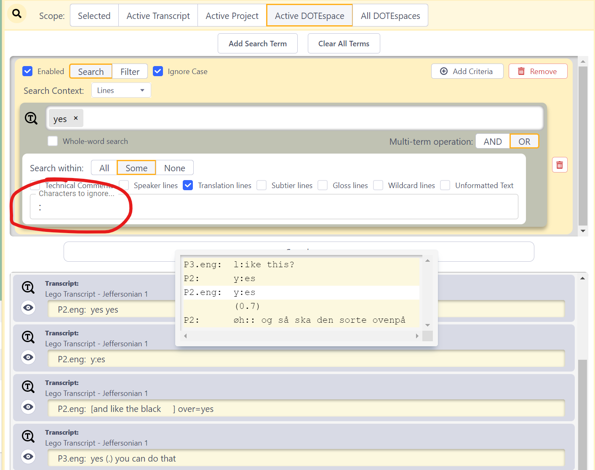

## Searching DOTEspaces

The Search panel allows the user to search across all Transcripts and Clips in a DOTEspace for text strings.
Multiple Search panels can be opened to conduct multiple Searches at the same time.

By entering a text string and selecting the search criteria, the results will be show and colour-coded in the search panel below.
- One can view the Transcript or Media Clip in context by clicking the view icon on each result.
- Such Clips can be edited using the pencil icon.
- For text found in transcripts, one can click on the line displayed to see a larger 5-line context.
Or one can click the view icon to see the complete context in the active Transcript panel, in which the search string is highlighted.

The Search can be restricted by the following criteria.

### Transcripts

For a fuller understanding of some of these choices, take a look at the _DOTE_ help guide on transcription and subtiers.

- Search in all transcript lines (or omit all lines from search)
- Search in all designated Speaker lines (or omit such lines from search)
- Search in `.translation` lines (or omit such lines from search)
- Search in `@gloss` lines (or omit such lines from search)
- Search in `#wildcard` (eg. `#fig`) lines (or omit such lines from search)
- Search in Subtier (translation, gloss or wildcard) lines (or omit such lines from search)
- Search in technical comments (//) (or omit such comments from search)
- Search in unformatted lines (or omit such lines from search)

For example, one could search across transcripts to find specific speakers or specific lexical items in a translation subtier (see example below) or a specific text in a technical comment.

### Clips

- Search all Clips (or omit Clips from search)
- Search all tags in clips (or omit tags from search)
- Search all Media Clips (or omit such clips from search)
- Search all Transcript Clips (or omit such clips from search)
- Search all user-defined fields/names (or omit such fields from search)
- Search all user-defined fields/values (or omit such fields from search)

For example, one could search across all clips to find clips with a specific tag (see example below) or across Media Clips only to find specific text in a comment.

Thus, _DOTEbase_ provides a powerful search engine that allows the user to narrow down searches. Not only can all the Transcripts in a DOTEspace be searched simultaneously, so can clips and their meta-data.
