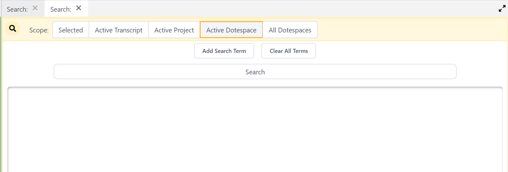

## Searching DOTEspaces

The Search panel allows the user to search across all Transcripts and Clips within the scope of a Transcript, Project, DOTEspace or all DOTEspaces.
Search targets and parameters can be easily combined to enable searches combining AND, OR and NOT.  
Multiple Search panels can be opened to conduct multiple Searches at the same time.

Searching requires one or more Targets, with further specification of criteria within the Target.
More advanced searching can combine Search Terms with AND, OR and NOT.

In the Search panel, there is a fundamental distinction made between a Search Term and a Filter Term.
The former searches only for those Targets that are specified in the Search Term(s).
The latter searches for everything in those Targets that is NOT specified in the Search Term(s), ie. it excludes them and therefore acts like a NOT.

Searches can be limited in their scope:

- Selected - Only search in those [DOTEspaces](dotespace.md), [Projects](dote.md) and [Transcripts](transcript.md) selected in the DOTEspaces panel
- Active Transcript - Only search in the active Transcript
- Active Project - Only search for Media Clips in the active Project
- Active DOTEspace - Only search in the active DOTEspace. This is the default.
- All DOTEspaces - Search everywhere

### Simple searching

First, a Search Term must be added and a Target for the search chosen.

The possible Targets include Transcripts, Tags, Annotations, User-Defined Fields (UDFs).
Once one of these Targets is chosen, more specific criteria for the search can be entered.

One can start a search straightaway...

1. Type the search term as a string of characters in the box.
2. Press ENTER or TAB and it will be added.
3. You can add more than one search term string.
4. Click the Search button and the results of the Search will be shown and colour-coded.
    - One can view the Transcript or Media Clip in context by clicking the view icon on each result.
    - Such Clips can be edited using the pencil icon.
    - For text found in transcripts, one can click on the line displayed to see a larger 5-line context.
Or one can click the view icon to see the complete context in the active Transcript panel, in which the search string is highlighted.

#### Extra criteria in a Search Term

There are a range of options for a Search Term:

1. One can enable/disable a Search Term. The default is enabled.
1. One can enter one or more text strings and choose AND/OR to combine them in a search. The default is OR.
1. One can require/ignore case in the search string(s). The default is ignore.
1. One can change the complete Search Term from a Search to a Filter. The default is Search.
2. One can change the Search element from a Search to a Filter. The default is Search.
3. One can `Add Criteria` to further restrict the Search. See below.

### Specifying Search Targets

The main Target of a Search Term can be specified in more detail.

#### Specifying the Transcript Target

For a fuller understanding of some of these choices, take a look at the _DOTE_ help guide on transcription and subtiers.

- Search in technical comments (//) (or omit such comments from search)
- Search in all designated Speaker lines (or omit such lines from search)
- Search in Subtier lines, eg. translation or gloss (or omit such lines from search)
- Search in `.translation` lines (or omit such lines from search)
- Search in `@gloss` lines (or omit such lines from search)
- Search in `#wildcard` (eg. `#fig`) lines (or omit such lines from search)
- Search in unformatted lines (or omit such lines from search)
- One can also add specific characters to a target in a search that should be ignored.
Just enter them as one continuous string of characters with no spaces (eg. `:[]*><°`).
This is very useful when searching for a lexical item that may include non lexical characters, eg. ":" or "[" or "]".
Thus, one can search for all instances of a word even though it may have one or more instances of colon (":") in it, eg. "yes", "ye:s" and "ye:::s" would all be found.

For example, one could search across transcripts in an active DOTEspace to find a specific lexical item and its variants ("yes", "YES", "ye:s" or "Ye::::s") in a Translation Subtier (see example below).

#### Specifying the Tags Target

By clicking in the Tags box, the current set of Tags in the selected Scope will be available to be selected in a drop-down list.

There are no options to further specify the Tags Target.

For example, one could search across an active Project to find all Clips with a specific set of Tags (see example below).

#### Specifying the Annotations Target

There are no options to further specify the Annotations Target.

#### Specifying the User-Defined Fields Target

There are two options:

- Search in Names
- Search in Values

### Rich search

_DOTEbase_ provides a powerful search engine that allows the user to narrow down searches. Not only can all the Transcripts in a DOTEspace be searched simultaneously, so can clips and their meta-data.

#### Adding criteria to a Search Term

#### Multiple Search/Filter targets

One can add multiple targets to a single search and combine them with boolean operators AND, OR and NOT.

### Multiple searches

It is possible to have many Search panels open in the DOTEbase window, either as Tabbed Searches or visible Search panels.
Each Search panel is independent.

It is not possible at present to save/load a Search configuration for future use.
Nor is it possible to send all the results of Clips found to a Collection.
These are features in the pipeline.
