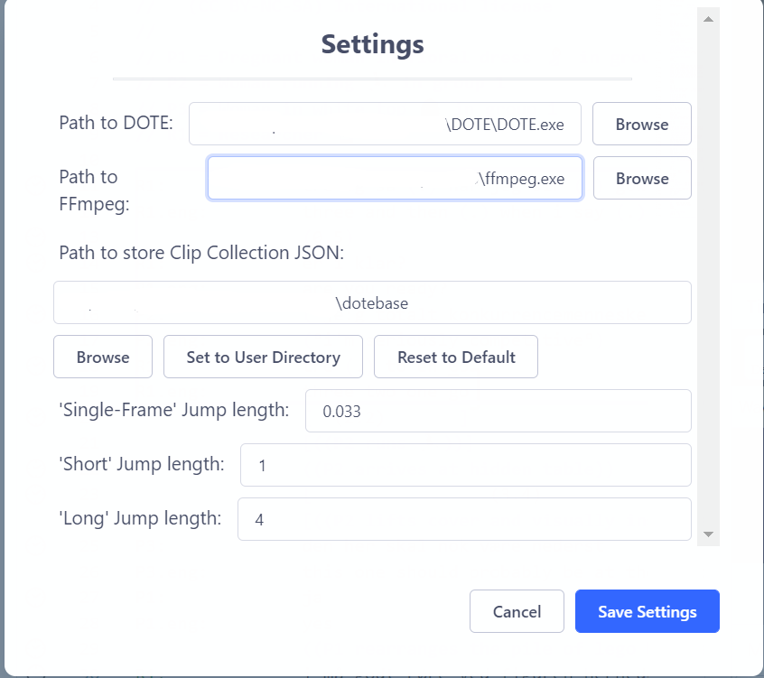

## Settings

There are a limited number of settings that can be used to alter the default behaviour of _DOTEbase_.

- The path on your file system to the installed _DOTE_ software package is required so that _DOTEbase_ can communicate with _DOTE_.
Browse and locate the path to the `DOTE.exe` file on your file system (macOS/Windows 10 or 11)
- The path to FFmpeg is recommended so that _DOTEbase_ can play the media files and display the waveforms correctly.
Browse and locate the path to the `FFmpeg.exe` file on your file system.
If you installed FFmpeg using _DOTE_ in Settings, then the path is listed there.
See the [DOTE help guide for more information about installing FFmpeg automatically](https://bigsoftvideo.github.io/DOTE/settings.html#ffmpeg) in _DOTE_ Settings.
- The path to the storage of clip collections is specified by _DOTEbase_ when installed, but it can be changed manually if you prefer a different file location.
- The single-frame jump length in seconds is user-definable, depending on the default frame rate of the media in the corpus.
- The short jump length in seconds is user-definable.
This changes the number of seconds when using shortcuts to jump forward/backward in small time increments while playing back media.
The default is 1 second.
- The long jump length in seconds is user-definable to jump forward/backward in larger time increments while playing back media.
The default is 4 seconds.
