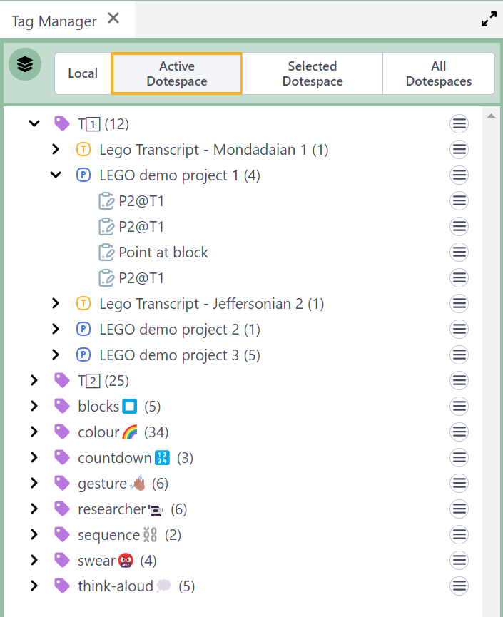

## How to Tag your Clips

Any Media Clip or Transcript Clip can have multiple Tags assigned to it.

- Tags are initially entered when creating a clip.
- Recent tags in the DOTEspace are autocompletable, ie. all known tags in the current DOTEspace are listed according to what is typed.
- Tags can be edited in currently existing Clips.

Tags are searchable using the [Search](search.md) tool.
Tags are listable in Clip listings in the [Media Clips Organiser](media-clips-organiser.md), the [Clips Viewer](clips-viewer.md), the [Collection Viewer](collection-viewer.md) and in clip nodes on the [Canvas](canvas.md).
They also are visible to the right of [Transcript Clips](transcript-clip.md) in a [Transcript](transcript.md) panel.

Also, filters can apply to listings in the [Clips Viewer](clips-viewer.md) and the [Collection Viewer](collection-viewer.md) to include/exclude Tags.

### Tag Manager

The Tag manager enables the user to add, delete and rename tags in and across DOTEspaces.

The Tag Manager opens as a panel anywhere in the DOTEbase window, just like any other tool panel.
It lists all the tags depending on the scope as well as all clips that have that tag assigned.

The scope of the listing of tags can be:
- Local: Only in the current Project
- Active DOTEspace: Only in the active DOTEspace
- Selected DOTEspace: Only in the selected DOTEspaces in the DOTEspaces panel
- All DOTEspaces

Under each Tag is listed the Project or Transcript in which the Tag appears.
And under each of those is listed all the Clips in which that Tag is found.
Click the `>` expansion icon to see the listings.

One can open/view the entry that has a specific Tag assigned.
- Open a Transcript or Project
- View a Transcript Clip or Media Clip

### Renaming Tags

Right clicking on a Tag, brings up the `Rename` operation.
All Clips that have been assigned that Tag can have that Tag renamed.

### Merging Tags

Right clicking on a Tag, brings up the `Merge` operation.
This will merge two Tags together under one unifying name.
All Clips with one or both Tags will have both merged into one Tag.
Thus, the number of Clips will usually increase in the new Tag listing.

### Deleting Tags

Right clicking on a Tag, brings up the `Delete` operation.
All Clips that have been assigned that Tag can have that Tag removed from those Clips.

### Tag Conflicts

