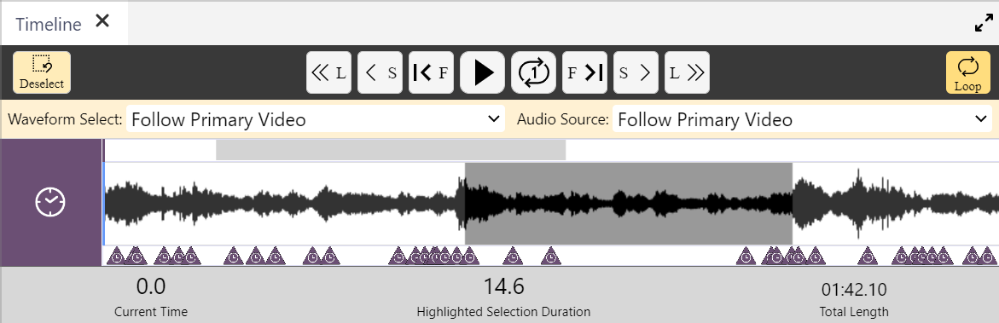

## Timeline and Waveform

Watch [video tutorial](https://www.youtube.com/watch?v=pfFxI_FYrM8) on YouTube.

The Timeline is very similar to that found in _DOTE_.
Its job is to represent where in the media source the current [Media Player](media-player.md) playhead.
It also is used to select a fragment (IN/OUT) for a [Media Clip](media-clip.md).

The Timeline includes some standard video playback transport controls, eg. play/pause, jump.
These can be operated with shortcuts.

There are other controls for playback speed as well as deselection and looping.

The current time (playhead location), highlighted selection duration (for loops and media clips) and total length of the media are always indicated.

On the Timeline, a Waveform can be superimposed.
This is first generated in _DOTE_ when a Project is created and media is added with the Media Manager.
If it happens to be missing, it will be regenerated in _DOTEbase_.

In the case of multiple media sources in a _DOTE_ project in a DOTEspace, the user can decide which waveform will be displayed and which audio source will be played back using the [Media Player](media-player.md).
In the case of video-cues created in _DOTE_, the user can still select which waveform to follow and which audio source to follow, or they can follow the current waveform/audio source dictated by the video-cues (Primary Video).
