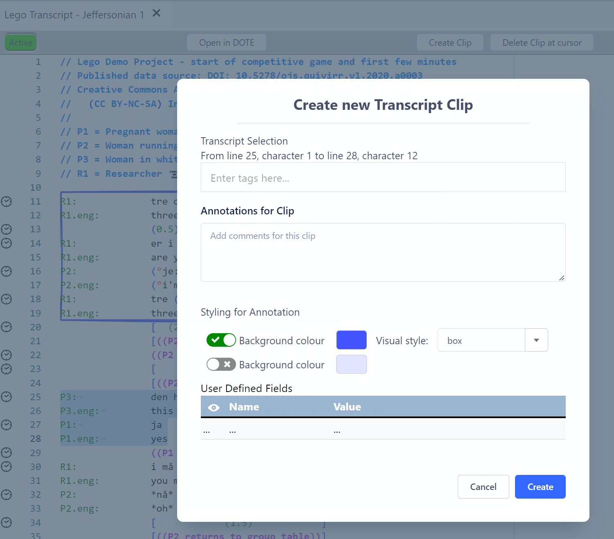
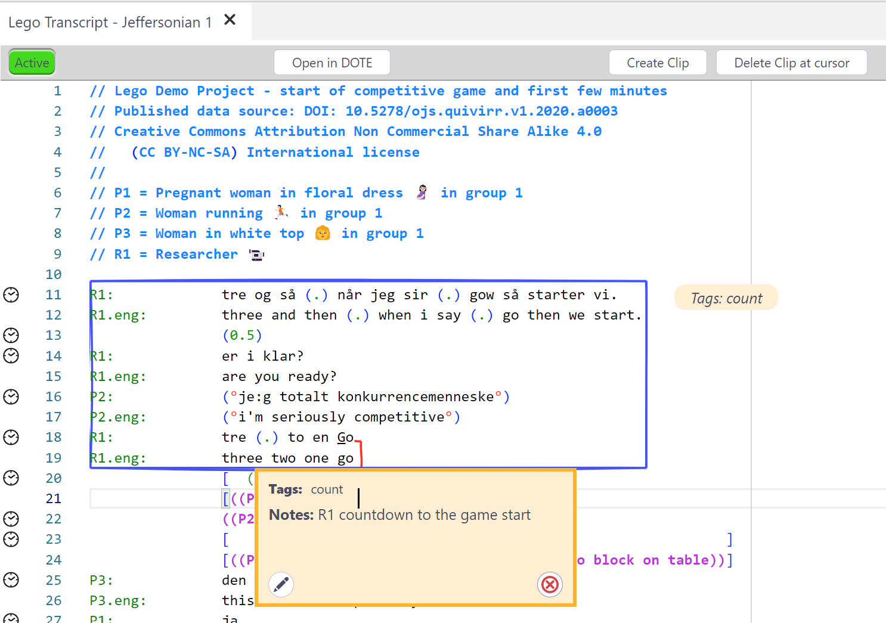
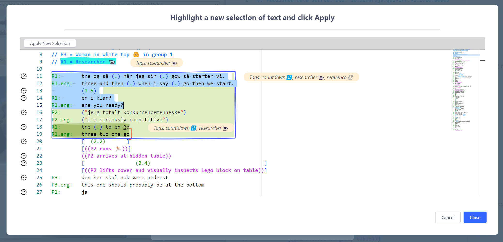

## How to make Transcript Clips

Transcript Clips (or T-clips) can be created and edited in _DOTE_ and _DOTEbase_ provided you have purchased and activated the Pro or Pro Community Edition in both.

### Making T-clips

1. The first step is to locate the relevant transcript that you wish to clip from.
1. Find the relevant lines to be clipped.
1. Select those lines using your mouse by dragging from the onset character/line to the offset character/line.
Clips do not have to start and terminate at the beginning or end of lines.
1. Then click the `CREATE CLIP` button in the respective Transcript panel.
1. There are several options to fill out or select when creating the clip:
  - Add [Tag(s)](tags.md)
  - Add a comment note
  - Choose the styling (background/foreground [colours](colour-manager.md)) and visual style for the clip
  - Add user-defined field names/values
1. Click CREATE and the clip will be inserted and displayed in the Transcript.
1. It will also be added to the list of clips in the current Project.

Follow the same procedure in _DOTE_.
When the Transcript is saved, then the clip will appear in _DOTEbase_ if that Transcript is included in the current DOTEspace.
If a Transcript is open in _DOTE_, then T-Clips in that Transcript cannot be edited in _DOTEbase_.
_DOTE_ locks the Transcript for editing.
If _DOTE_ is closed or a different Transcript is opened, then the Transcript is released and can be edited again in _DOTEbase_.

#### Applying a Clip Preset

See [Clip Presets](clip-presets.md) for more information.

### Editing and deleting Transcript Clips

T-clips can be edited and deleted.

#### Method 1

- Hover over the clip and select the pencil edit or delete icon in the T-clip panel that opens.

#### Method 2

- Click uniquely inside the T-clip in a transcript panel.
Make sure that the cursor is inside only one clip.
- Select Delete Clip at Cursor.

#### Method 3

- Find the clip in the Clips Viewer, the Collection Viewer or a Search result.
- Click the pencil icon or the delete icon.

### Changing the scope of an existing T-Clip

The scope of a T-Clip can be adjusted using the `Edit Selection` button at the top of the Edit T-Clip box.
- Scroll to find the original clip.
- Make a new selection for the scope of the T-clip by dragging the cursor from the onset to the offset character.
- Click `APPLY NEW SELECTION` button.

### Sending a Transcript Clip to the Canvas

Expanding a Transcript Clip in the Clips Viewer, the Collection Viewer or Search will reveal a button `Send to CANVAS`.
Open the Canvas and the Clip will be available to drag onto the Canvas at the bottom right.
