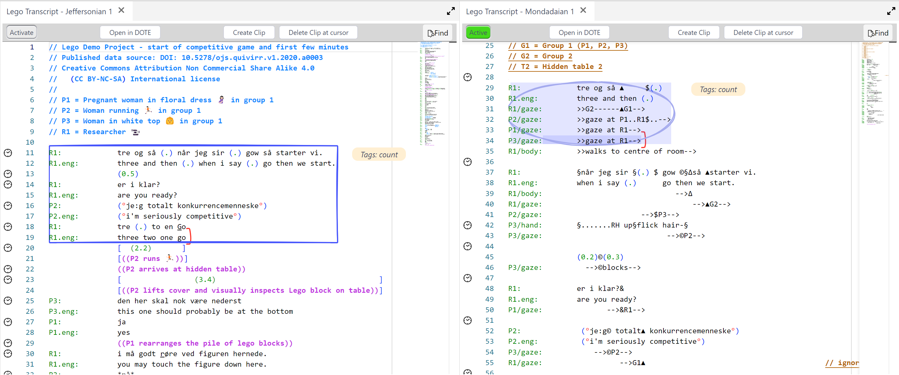

## Transcript panel

The Transcript panel displays the currently open Transcript created in _DOTE_.
Each Transcript panel displays a Transcript with line numbers as it was edited in _DOTE_.
All the [sync-codes](https://bigsoftvideo.github.io/DOTE/sync-code.html) will be displayed, which index specific time-stamps in the media, thus tying the Transcript lines to the media source(s).

Multiple Transcript panels can be opened in _DOTEbase_.
Just click the TRANSCRIPT button in the menu bar.
A new Transcript panel will appear, which can be dragged and dropped in the UI layout.
One of the Transcript panels must be designated as the ACTIVE one, while the others are unactivated.
What this means is that when switching Transcripts, only the ACTIVE panel will display the Transcript that is newly selected.
The unactivated Transcripts will still show their current contents.
As a result, one can open multiple Transcripts across the DOTEspace at the same time and view their contents simultaneously.

Use the Transcripts or the Clipping Transcripts predetermined [Layouts](layout.md) to focus on working with Transcripts and [Transcript Clipping](transcript-clip.md).
